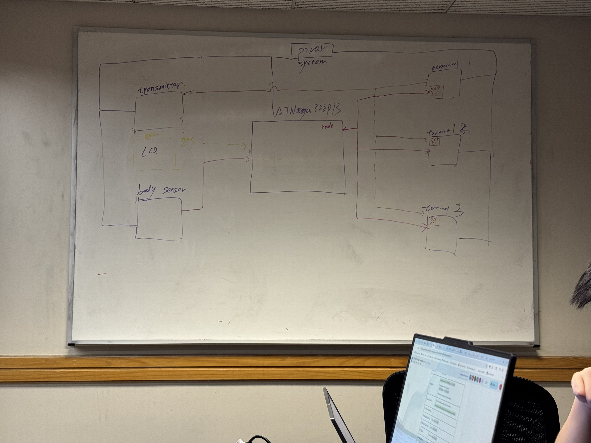
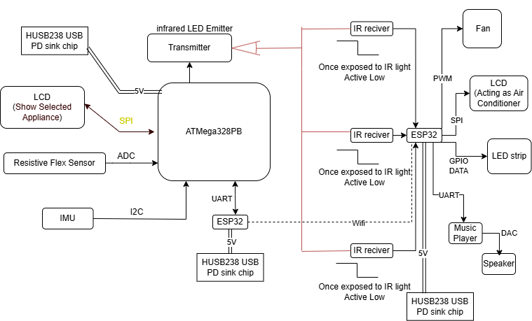

# final-project-skeleton

**Team Number: T01**

**Team Name:**

| Team Member Name | Email Address           |
| ---------------- | ----------------------- |
| Shunyao Jiang    | jiang24@seas.upenn.edu  |
| Sirui Wu         | wu40@seas.upenn.edu     |
| Jingyi Huang     | huang965@seas.upenn.edu |

**GitHub Repository URL: https://github.com/upenn-embedded/final-project-f25-f25-final_project_t1.git**

**GitHub Pages Website URL:** [for final submission]*

## Final Project Proposal

### 1. Abstract

*In a few sentences, describe your final project.*

Our system is a gesture-controlled smart home wristband that enables users to control multiple household devices. The wrist module integrates an ESP32, IMU, LCD display, vibration motor (for user feedback), ATmega32 , and  infrared transmitter . It recognizes gestures to generate control commands and allows users to select the target device either by pointing with the infrared beam or by waving to cycle through devices shown on the wrist display.

Each appliance has its  own infrared receiver  managed by a  single ESP32 controller, which interprets the IR pairing signals and executes the corresponding control actions.  After pairing, the ESP32 processes the recognized gestures to control both the power state (ON/OFF) and functional parameters of each device. For example, adjust fan speed, change lighting color/brightness, change the temperature and mode of air conditioner represents by LCD, and the music player supports  play/pause, track switching, and volume adjustment .

The LCD on the wristband indicates the currently selected device and recognized command, while the vibration motor provides tactile feedback to the user after each successful gesture.

### 2. Motivation

*What is the problem that you are trying to solve? Why is this project interesting? What is the intended purpose?*

People often misplace their remote control or phone when sitting on the sofa or chair. Traditional home appliances are typically operated through wall switches or dedicated remotes, while modern smart-home devices rely on smartphone apps or voice assistants. Both approaches require extra steps — such as picking up the phone, finding the right app, or issuing voice commands — which can be  slow, inconvenient, or unreliable , especially in noisy environments where voice recognition fails.

Furthermore, most current smart-home systems require appliances to have built-in IoT modules, making it difficult for legacy devices to be integrated. We aim to create a wearable, unobtrusive wristband that allows users to control any household appliance intuitively through  pointing and hand gestures .

Each appliance is equipped with a unique infrared (IR) code that can be paired with the wristband through a simple  IR pairing process . When the user points toward a specific device, the wristband determines the target direction using its  IMU orientation data , verifies the paired IR code, and transmits the corresponding IR control signal to perform the intended action.

This approach enables seamless control of both modern and traditional appliances —  without a phone, app, or voice assistant . Unlike camera-based gesture systems, our design uses only  on-board IMU and infrared communication , ensuring complete privacy, low power consumption, and real-time response in any lighting condition.

### 3. System Block Diagram

Draft:

Block Diagram:

### 4. Design Sketches

*What will your project look like? Do you have any critical design features? Will you need any special manufacturing techniques to achieve your vision, like power tools, laser cutting, or 3D printing?  Submit drawings for this section.*

### 5. Software Requirements Specification (SRS)

The system shall:

1. Detect and classify hand and wrist gestures using IMU sensor data.
2. Allow device selection either by infrared pointing or gesture-based (backup) cycling .
3. IR LED for pairing.
4. Transmit control commands (ON/OFF, mode, level, or value changes) to the ESP32 controller wirelessly.
5. Provide real-time visual feedback on the wrist LCD and haptic feedback via the vibration motor.
6. Update controlled devices'  states (fan, light, air conditioner demo screen, music player) accordingly.

**5.1 Definitions, Abbreviation**

| Term            | Definition                                                                                   |
| --------------- | -------------------------------------------------------------------------------------------- |
| IMU             | Inertial Measurement Unit, used to detect wrist and hand motion.                             |
| IR              | Infrared signal used for device pairing and pointing control.                                |
| ESP32           | Microcontroller with built-in Wi-Fi and Bluetooth, used in both wristband and receiver unit. |
| LCD             | Liquid Crystal Display showing device and command status.                                    |
| Haptic Feedback | Vibration feedback provided to the user for confirmation.                                    |

---

5.2 Functionality

| ID     | Description (Measurable Requirement)                                                                   | Verification Method                                                             |
| ------ | ------------------------------------------------------------------------------------------------------ | ------------------------------------------------------------------------------- |
| HRS-01 | The IMU sensor shall detect wrist rotation and acceleration with an accuracy of ±10%.                 | Use usrt output wrist ratation and compare with real movitation         |
| HRS-02 | The IR transmitter shall emit a signal detectable by receivers within 3 m in normal lighting.          | Measure IR detection distance and angle using IR receiver output. |
| HRS-03 | The ESP32 shall process gesture inputs and send control signals with latency <500 ms.                 | Control buzzer to beep when gesture happens, using stopwatch to record respond time             |
| HRS-04 | The vibration motor shall generate a feedback pulse of 200 ± 50 ms duration after each pairing success. | Measure motor activation time with stopwatch.                   |
| HRS-05 | The LCD display shall update device and command information within 1s of command recognition.      | Observe update speed using timestamped logs or slow-motion video.               |
| HRS-06 | The receiver ESP32 shall control all four output devices.          | Test each device's response      |

### 6. Hardware Requirements Specification (HRS)

The hardware system shall:

1. Accurately detect wrist and hand motion using the IMU sensor.
2. Transmit and receive infrared signals reliably for device pairing and pointing control.
3. Process gesture data and communication tasks using the ESP32 microcontroller.
4. Control four different output devices (fan, light, air conditioner demo screen, music player) through a single ESP32 receiver board.
5. Maintain stable wireless communication and power operation within a 3 m indoor range.

**6.1 Definitions, Abbreviations**

Here, you will define any special terms, acronyms, or abbreviations you plan to use for hardware

| Term  | Definition                                                              |
| ----- | ----------------------------------------------------------------------- |
| IMU   | Inertial Measurement Unit for detecting motion and gesture orientation. |
| IR    | Infrared signal used for device pairing and pointing control.           |
| ESP32 | Main processing microcontroller handling communication and logic.       |
| LCD   | Liquid Crystal Display for showing current device and command status.   |
| PWM   | Pulse Width Modulation used to control motor speed or LED brightness.   |

**6.2 Functionality**

### 6. Hardware Requirements Specification (HRS)

| ID | Description | Verification Method |
|----|--------------|---------------------|
| **HRS-01 (IR Selection and Detection)** | The controller shall transmit modulated IR bursts at 38 kHz. A valid hit shall be recognized and reported to the controller within 50 ms. | Point to different terminals many times to verify the selection. |
| **HRS-02 (IR Coverage and Range)** | The IR link shall maintain reliable operation at 3 m ± 45° in front of the receiver under standard indoor lighting. | Point at the same terminal from different angles many times and show the result. |
| **HRS-03 (IMU Sampling and Interface)** | The IMU module shall output 3-axis acceleration and angular-velocity data at ≥ 100 Hz, communicating with the controller via I²C (400 kHz). | Use UART to print the raw data from the IMU and check if it is stable. |
| **HRS-04 (PWM Output Hardware)** | The fan terminal’s ESP32 shall generate motor-control signals with different frequencies and duty cycles. | Change the command and observe the output PWM using an oscilloscope. |
| **HRS-05 (Power and Protection)** | All boards shall operate from a regulated 5 V ± 5 % supply; the IR-LED driver shall limit continuous current to ≤ 200 mA and include reverse-polarity and over-current protection. | Use a DMM to test all connections, voltage, and current. |

### 7. Bill of Materials (BOM)

[BOM](https://docs.google.com/spreadsheets/d/1ShClJ0_CxjcdzTeQjC180BvYrUsWIu_XtLVTxZC1Zqk/edit?usp=sharing)

### 8. Final Demo Goals

On demo day, we will demonstrate the gesture-controlled infrared wristband in an  indoor smart-home setup . The wristband will be  worn on the user's wrist , and several IR receiver modules will control mock appliances such as a lamp and fan.

The demo will include:

1. Pairing – The user points at an terminal(fan, LCD music player, motor) and pairs it via IR.
2. Control – Gestures like hand opening or wrist lifting recognized by ATMega328PB and output command through ESP32.
3. Feedback – The appliance responds (e.g., LED brightness change, or motor speed up)

The system will run in a at least 3 m × 3 m area , powered by power bank with Power delivery. 

### 9. Sprint Planning

*You've got limited time to get this project done! How will you plan your sprint milestones? How will you distribute the work within your team? Review the schedule in the final project manual for exact dates.*

| Milestone  | Functionality Achieved                                                                                                         | Distribution of Work                                                                                                                                                                                      |
| ---------- | ------------------------------------------------------------------------------------------------------------------------------ | --------------------------------------------------------------------------------------------------------------------------------------------------------------------------------------------------------- |
| Sprint #1  | Basic IMU gesture detection (hand open / wrist lift); single-device IR transmission test                                       | Shunyao Jiang: IMU data collection and gesture classification algorithm Sirui Wu: IR transmitter and receiver circuit prototyping Jingyi Huang: Microcontroller setup and communication testing |
| Sprint #2  | IR pairing logic for multi-device control; combine IMU + IR modules on wristband                                               | Shunyao Jiang: Firmware integration of gesture and IR modules  Sirui Wu: Compact hardware design and power management Jingyi Huang: IR pairing protocol and system debugging                    |
| MVP Demo   | Working prototype controlling two appliances (lamp and fan) via gestures; LED and vibrationfeedback confirmation               | Shunyao Jiang: Optimize gesture detection and reduce latency Sirui Wu: Assemble wristband and receiver modules Jingyi Huang: Coordinate demo setup and test user interactions                   |
| Final Demo | Fully wearable wristband with rechargeable battery, accurate gesture recognition, and stable IR control of multiple appliances | Shunyao Jiang: Final firmware refinement and data smoothing Sirui Wu: Hardware polishing and enclosure assembly Jingyi Huang: Integration, presentation, and live demonstration coordination    |

**This is the end of the Project Proposal section. The remaining sections will be filled out based on the milestone schedule.**

## Sprint Review #1

### Last week's progress

### Current state of project

### Next week's plan

## Sprint Review #2

### Last week's progress

### Current state of project

### Next week's plan

## MVP Demo

1. Show a system block diagram & explain the hardware implementation.
2. Explain your firmware implementation, including application logic and critical drivers you've written.
3. Demo your device.
4. Have you achieved some or all of your Software Requirements Specification (SRS)?

   1. Show how you collected data and the outcomes.
5. Have you achieved some or all of your Hardware Requirements Specification (HRS)?

   1. Show how you collected data and the outcomes.
6. Show off the remaining elements that will make your project whole: mechanical casework, supporting graphical user interface (GUI), web portal, etc.
7. What is the riskiest part remaining of your project?

   1. How do you plan to de-risk this?
8. What questions or help do you need from the teaching team?

## Final Project Report

Don't forget to make the GitHub pages public website!
If you’ve never made a GitHub pages website before, you can follow this webpage (though, substitute your final project repository for the GitHub username one in the quickstart guide):  [https://docs.github.com/en/pages/quickstart](https://docs.github.com/en/pages/quickstart)

### 1. Video

[Insert final project video here]

* The video must demonstrate your key functionality.
* The video must be 5 minutes or less.
* Ensure your video link is accessible to the teaching team. Unlisted YouTube videos or Google Drive uploads with SEAS account access work well.
* Points will be removed if the audio quality is poor - say, if you filmed your video in a noisy electrical engineering lab.

### 2. Images

[Insert final project images here]

*Include photos of your device from a few angles. If you have a casework, show both the exterior and interior (where the good EE bits are!).*

### 3. Results

*What were your results? Namely, what was the final solution/design to your problem?*

#### 3.1 Software Requirements Specification (SRS) Results

*Based on your quantified system performance, comment on how you achieved or fell short of your expected requirements.*

*Did your requirements change? If so, why? Failing to meet a requirement is acceptable; understanding the reason why is critical!*

*Validate at least two requirements, showing how you tested and your proof of work (videos, images, logic analyzer/oscilloscope captures, etc.).*

| ID     | Description                                                                                               | Validation Outcome                                                                          |
| ------ | --------------------------------------------------------------------------------------------------------- | ------------------------------------------------------------------------------------------- |
| SRS-01 | The IMU 3-axis acceleration will be measured with 16-bit depth every 100 milliseconds +/-10 milliseconds. | Confirmed, logged output from the MCU is saved to "validation" folder in GitHub repository. |

#### 3.2 Hardware Requirements Specification (HRS) Results

*Based on your quantified system performance, comment on how you achieved or fell short of your expected requirements.*

*Did your requirements change? If so, why? Failing to meet a requirement is acceptable; understanding the reason why is critical!*

*Validate at least two requirements, showing how you tested and your proof of work (videos, images, logic analyzer/oscilloscope captures, etc.).*

| ID     | Description                                                                                                                        | Validation Outcome                                                                                                      |
| ------ | ---------------------------------------------------------------------------------------------------------------------------------- | ----------------------------------------------------------------------------------------------------------------------- |
| HRS-01 | A distance sensor shall be used for obstacle detection. The sensor shall detect obstacles at a maximum distance of at least 10 cm. | Confirmed, sensed obstacles up to 15cm. Video in "validation" folder, shows tape measure and logged output to terminal. |
|        |                                                                                                                                    |                                                                                                                         |

### 4. Conclusion

Reflect on your project. Some questions to address:

* What did you learn from it?
* What went well?
* What accomplishments are you proud of?
* What did you learn/gain from this experience?
* Did you have to change your approach?
* What could have been done differently?
* Did you encounter obstacles that you didn’t anticipate?
* What could be a next step for this project?

## References

Fill in your references here as you work on your final project. Describe any libraries used here.
