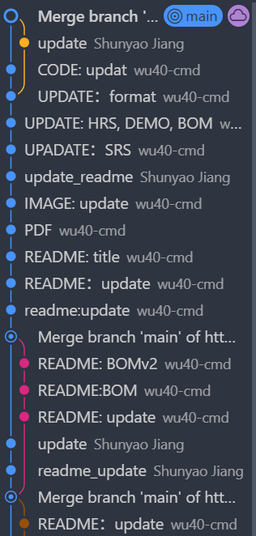
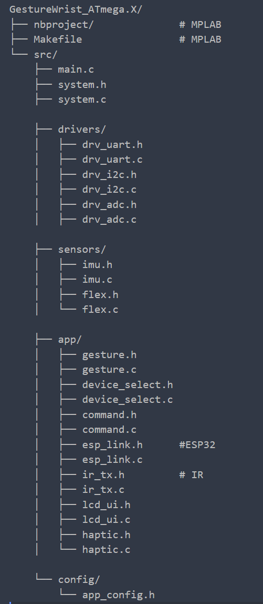
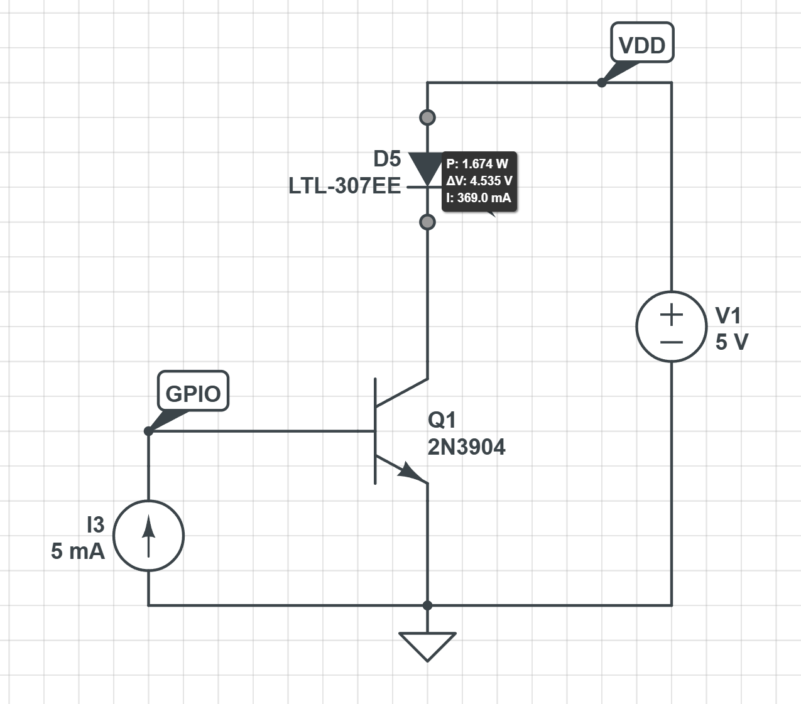
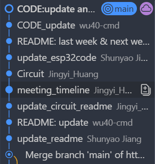
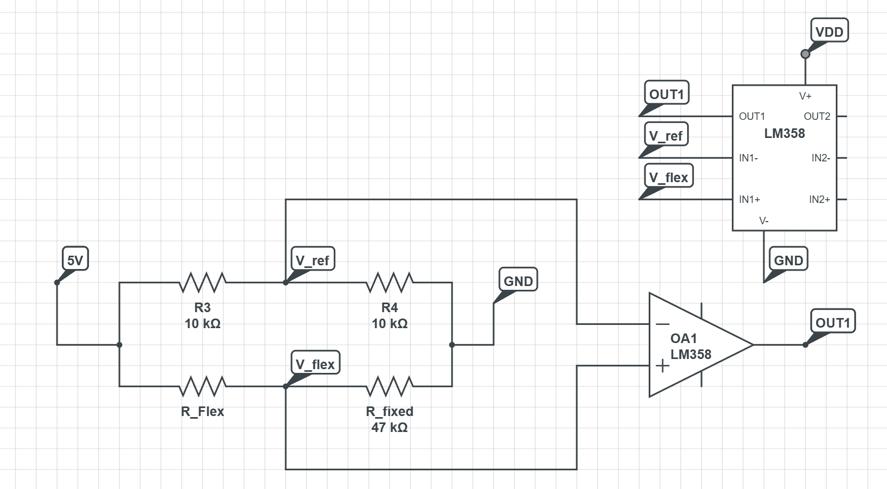
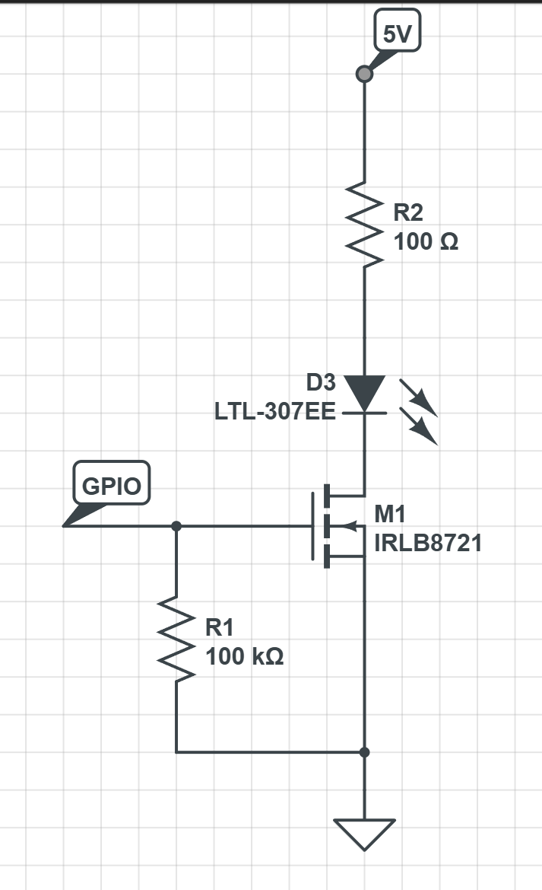
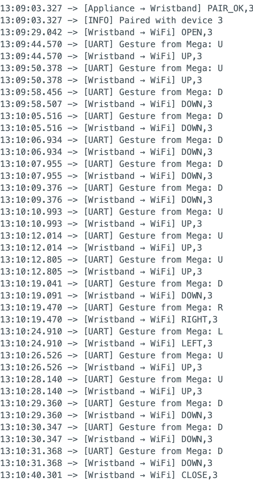
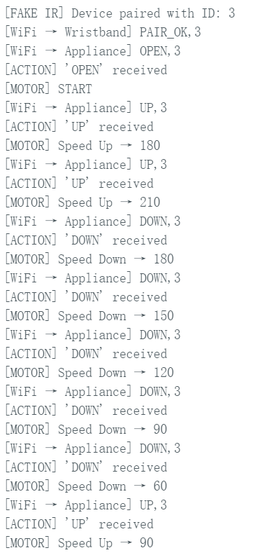
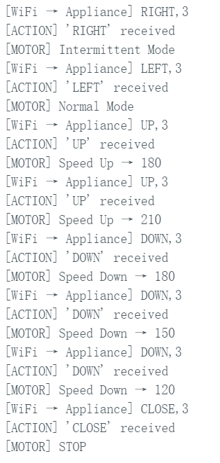

[](https://classroom.github.com/a/a-5mB3GB)

# final-project-skeleton

**Team Number: T01**

**Team Name:**

| Team Member Name | Email Address           |
| ---------------- | ----------------------- |
| Shunyao Jiang    | jiang24@seas.upenn.edu  |
| Sirui Wu         | wu40@seas.upenn.edu     |
| Jingyi Huang     | huang965@seas.upenn.edu |

**GitHub Repository URL: https://github.com/upenn-embedded/final-project-f25-f25-final_project_t1.git**

**GitHub Pages Website URL:** [for final submission]*

## Final Project Proposal

### 1. Abstract

*In a few sentences, describe your final project.*

Our system is a gesture-controlled smart home wristband that enables users to control multiple household devices. The wrist module integrates an ESP32, IMU, LCD display, vibration motor (for user feedback), ATmega32 , and  infrared transmitter . It recognizes gestures to generate control commands and allows users to select the target device either by pointing with the infrared beam or by waving to cycle through devices shown on the wrist display.

Each appliance has its  own infrared receiver  managed by a  single ESP32 controller, which interprets the IR pairing signals and executes the corresponding control actions.  After pairing, the ESP32 processes the recognized gestures to control both the power state (ON/OFF) and functional parameters of each device. For example, adjust fan speed, change lighting color/brightness, change the temperature and mode of air conditioner represents by LCD, and the music player supports  play/pause, track switching, and volume adjustment .

The LCD on the wristband indicates the currently selected device and recognized command, while the vibration motor provides tactile feedback to the user after each successful gesture.

### 2. Motivation

*What is the problem that you are trying to solve? Why is this project interesting? What is the intended purpose?*

People often misplace their remote control or phone when sitting on the sofa or chair. Traditional home appliances are typically operated through wall switches or dedicated remotes, while modern smart-home devices rely on smartphone apps or voice assistants. Both approaches require extra steps — such as picking up the phone, finding the right app, or issuing voice commands — which can be  slow, inconvenient, or unreliable , especially in noisy environments where voice recognition fails.

Furthermore, most current smart-home systems require appliances to have built-in IoT modules, making it difficult for legacy devices to be integrated. We aim to create a wearable, unobtrusive wristband that allows users to control any household appliance intuitively through  pointing and hand gestures .

Each appliance is equipped with a unique infrared (IR) code that can be paired with the wristband through a simple  IR pairing process . When the user points toward a specific device, the wristband determines the target direction using its  IMU orientation data , verifies the paired IR code, and transmits the corresponding IR control signal to perform the intended action.

This approach enables seamless control of both modern and traditional appliances —  without a phone, app, or voice assistant . Unlike camera-based gesture systems, our design uses only  on-board IMU and infrared communication , ensuring complete privacy, low power consumption, and real-time response in any lighting condition.

### 3. System Block Diagram

Draft:


Block Diagram:


### 4. Design Sketches

*What will your project look like? Do you have any critical design features? Will you need any special manufacturing techniques to achieve your vision, like power tools, laser cutting, or 3D printing?  Submit drawings for this section.*


### 5. Software Requirements Specification (SRS)

The system shall:

1. Detect and classify hand and wrist gestures using IMU sensor data.
2. Allow device selection either by infrared pointing or gesture-based (backup) cycling .
3. IR LED for pairing.
4. Transmit control commands (ON/OFF, mode, level, or value changes) to the ESP32 controller wirelessly.
5. Provide real-time visual feedback on the wrist LCD and haptic feedback via the vibration motor.
6. Update controlled devices'  states (fan, light, air conditioner demo screen, music player) accordingly.

**5.1 Definitions, Abbreviation**

| Term            | Definition                                                                                   |
| --------------- | -------------------------------------------------------------------------------------------- |
| IMU             | Inertial Measurement Unit, used to detect wrist and hand motion.                             |
| IR              | Infrared signal used for device pairing and pointing control.                                |
| ESP32           | Microcontroller with built-in Wi-Fi and Bluetooth, used in both wristband and receiver unit. |
| LCD             | Liquid Crystal Display showing device and command status.                                    |
| Haptic Feedback | Vibration feedback provided to the user for confirmation.                                    |

5.2 Functionality

| ID     | Description (Measurable Requirement)                                                                     | Verification Method                                                                 |
| ------ | -------------------------------------------------------------------------------------------------------- | ----------------------------------------------------------------------------------- |
| SRS-01 | The IMU sensor shall detect wrist rotation and acceleration with an accuracy of ±10%.                   | Use usrt output wrist ratation and compare with real movitation                     |
| SRS-02 | The IR transmitter shall emit a signal detectable by receivers within 3 m in normal lighting.            | Measure IR detection distance and angle using IR receiver output.                   |
| SRS-03 | The ESP32 shall process gesture inputs and send control signals with latency <500 ms.                   | Control buzzer to beep when gesture happens, using stopwatch to record respond time |
| SRS-04 | The vibration motor shall generate a feedback pulse of 200 ± 50 ms duration after each pairing success. | Measure motor activation time with stopwatch.                                       |
| SRS-05 | The LCD display shall update device and command information within 1s of command recognition.            | Observe update speed using timestamped logs or slow-motion video.                   |
| SRS-06 | The receiver ESP32 shall control all four output devices.                                                | Test each device's response                                                         |

### 6. Hardware Requirements Specification (HRS)

The hardware system shall:

1. Accurately detect wrist and hand motion using the IMU sensor.
2. Transmit and receive infrared signals reliably for device pairing and pointing control.
3. Process gesture data and communication tasks using the ESP32 microcontroller.
4. Control four different output devices (fan, light, air conditioner demo screen, music player) through a single ESP32 receiver board.
5. Maintain stable wireless communication and power operation within a 3 m indoor range.

**6.1 Definitions, Abbreviations**

Here, you will define any special terms, acronyms, or abbreviations you plan to use for hardware

| Term  | Definition                                                              |
| ----- | ----------------------------------------------------------------------- |
| IMU   | Inertial Measurement Unit for detecting motion and gesture orientation. |
| IR    | Infrared signal used for device pairing and pointing control.           |
| ESP32 | Main processing microcontroller handling communication and logic.       |
| LCD   | Liquid Crystal Display for showing current device and command status.   |
| PWM   | Pulse Width Modulation used to control motor speed or LED brightness.   |

**6.2 Functionality**

### 6. Hardware Requirements Specification (HRS)

| ID                                            | Description                                                                                                                                                                          | Verification Method                                                              |
| --------------------------------------------- | ------------------------------------------------------------------------------------------------------------------------------------------------------------------------------------ | -------------------------------------------------------------------------------- |
| **HRS-01 (IR Selection and Detection)** | The controller shall transmit modulated IR bursts at 38 kHz. A valid hit shall be recognized and reported to the controller within 50 ms.                                            | Point to different terminals many times to verify the selection.                 |
| **HRS-02 (IR Coverage and Range)**      | The IR link shall maintain reliable operation at 3 m ± 45° in front of the receiver under standard indoor lighting.                                                                | Point at the same terminal from different angles many times and show the result. |
| **HRS-03 (IMU Sampling and Interface)** | The IMU module shall output 3-axis acceleration and angular-velocity data at ≥ 100 Hz, communicating with the controller via I²C (400 kHz).                                        | Use UART to print the raw data from the IMU and check if it is stable.           |
| **HRS-04 (PWM Output Hardware)**        | The fan terminal’s ESP32 shall generate motor-control signals with different frequencies and duty cycles.                                                                           | Change the command and observe the output PWM using an oscilloscope.             |
| **HRS-05 (Power and Protection)**       | All boards shall operate from a regulated 5 V ± 5 % supply; the IR-LED driver shall limit continuous current to ≤ 200 mA and include reverse-polarity and over-current protection. | Use a DMM to test all connections, voltage, and current.                         |

### 7. Bill of Materials (BOM)

[BOM](https://docs.google.com/spreadsheets/d/1ShClJ0_CxjcdzTeQjC180BvYrUsWIu_XtLVTxZC1Zqk/edit?usp=sharing)

### 8. Final Demo Goals

On demo day, we will demonstrate the gesture-controlled infrared wristband in an  indoor smart-home setup . The wristband will be  worn on the user's wrist , and several IR receiver modules will control mock appliances such as a lamp and fan.

The demo will include:

1. Pairing – The user points at an terminal(fan, LCD music player, motor) and pairs it via IR.
2. Control – Gestures like hand opening or wrist lifting recognized by ATMega328PB and output command through ESP32.
3. Feedback – The appliance responds (e.g., LED brightness change, or motor speed up)

The system will run in a at least 3 m × 3 m area , powered by power bank with Power delivery.

### 9. Sprint Planning

*You've got limited time to get this project done! How will you plan your sprint milestones? How will you distribute the work within your team? Review the schedule in the final project manual for exact dates.*

| Milestone  | Functionality Achieved                                                                                                         | Distribution of Work                                                                                                                                                                                      |
| ---------- | ------------------------------------------------------------------------------------------------------------------------------ | --------------------------------------------------------------------------------------------------------------------------------------------------------------------------------------------------------- |
| Sprint #1  | Basic IMU gesture detection (hand open / wrist lift); single-device IR transmission test                                       | Shunyao Jiang: IMU data collection and gesture classification algorithm<br />Sirui Wu: IR transmitter and receiver circuit prototyping<br />Jingyi Huang: Microcontroller setup and communication testing |
| Sprint #2  | IR pairing logic for multi-device control; combine IMU + IR modules on wristband                                               | Shunyao Jiang: Firmware integration of gesture and IR modules<br /> Sirui Wu: Compact hardware design and power management<br />Jingyi Huang: IR pairing protocol and system debugging                    |
| MVP Demo   | Working prototype controlling two appliances (lamp and fan) via gestures; LED and vibrationfeedback confirmation               | Shunyao Jiang: Optimize gesture detection and reduce latency<br />Sirui Wu: Assemble wristband and receiver modules<br />Jingyi Huang: Coordinate demo setup and test user interactions                   |
| Final Demo | Fully wearable wristband with rechargeable battery, accurate gesture recognition, and stable IR control of multiple appliances | Shunyao Jiang: Final firmware refinement and data smoothing<br />Sirui Wu: Hardware polishing and enclosure assembly<br />Jingyi Huang: Integration, presentation, and live demonstration coordination    |

**This is the end of the Project Proposal section. The remaining sections will be filled out based on the milestone schedule.**

## Sprint Review #1

### Last week's progress

During this sprint, we focused on initial subsystem bring-up and early-stage feature development. Our key accomplishments include:

**1. IMU Gesture Recognition**

* Implemented and tested the basic IMU functionality on the ATmega328PB wrist module.
* Successfully achieved 4-direction gesture detection (up, down, left, right).
* Verified motion thresholds, filtering logic, and interrupt-based sampling behavior.
* [Code library](https://github.com/upenn-embedded/final-project-f25-f25-final_project_t1/tree/main/lib)

**2. System-Level Code Architecture**

Completed the  overall firmware architecture design , including module-level separation for:

* Wristband IMU processing
* Device selection interface on TFT LCD
* IR transmission module
* ESP32 ↔ ATmega communication

Created scaffolding files for easier future integration.

**3. IR Transmitter Driver Circuit**

* Built and tested the current-amplifying transistor stage for driving high-power IR LEDs.
* Verified correct switching behavior and validated expected current through IR LED during bench testing using multimeter.

**4. Proof of Work**

* Firmware commits pushed to GitHub (IMU module, project structure setup).

  

  
* Breadboard test photos for the IR driver stage.
* Videos demonstrating basic IMU directional detection.

  https://drive.google.com/file/d/1PLXOXZthyoQXSDA5x4BB6909TSStif7H/view?usp=drive_link

  

  We can see from simulation that the input current is amplified to 369mA, which met the requirement of the IR emitter.

### Current state of project

The project is currently in the  early preparation and subsystem prototyping stage :

**Hardware Procurement**

* Most components (flex sensors, IR receiver modules, IMU backup, vibration motor replacements, etc.) have been ordered and are expected to arrive next week.
* Not all hardware is on hand yet, so full-system assembly has not begun.

**System Progress**

* High-level architecture is complete and validated by the team.
* Subsystems currently under development:
  * Gesture recognition pipeline
  * IR driver circuit
  * Display interface (pending)
  * Flex sensor processing (pending)
  * ATmega ↔ ESP32 communication (pending)

**Status Summary**

The project remains in the early phase, but successful completion of IMU + IR subsystem bring-up gives us a strong foundation. These early modules will significantly reduce integration difficulty in later stages.

### Next week's plan

Next week will focus on  **hardware validation ,  module expansion , and  multi-component integration .**

**3.1 Hardware Bring-Up (Estimated 4 hours)**

| Task                                              | Member                  | Definition of Done                                               |
| ------------------------------------------------- | ----------------------- | ---------------------------------------------------------------- |
| Test IR pairing modules                           | Jingyi Huang            | IR transmitter recognized by receiver; stable decoding confirmed |
| Test wristband IMU, vibration motor, flex sensors | Sirui Wu ,Shunyao Jiang | Sensor readings verified on serial output; thresholds calibrated |

---

**3.2 Module Development (Estimated 6 hours)**

**Flex Sensor Module**

* **Members** : Shunyao Jiang, Jingyi Huang, Sirui Wu
* **Done When** :
* Flex sensor ADC readings are stable
* Basic gesture states classified
* Demo plots or printed readings captured

**Wrist Display UI**

* **Members** : Shunyao Jiang, Jingyi Huang
* **Done When** :
* Device selection UI shows icons or simple graphics
* UI can switch screens based on gestures

**ESP32 ↔ ATmega328PB Communication**

* **Members** : Sirui Wu, Shunyao Jiang
* **Done When** :
* Basic UART communication established
* Command packet format defined
* Successful command transfer demo

**IR Transmitter Circuit Assembly**

* **Member** : Jingyi Huang
* **Done When** :
* Final IR driver circuit soldered/built
* Measured LED peak current matches design


### **Summary**

We have completed the early-stage gesture recognition and IR hardware verification. Next week aims to integrate newly arrived hardware, expand sensing and UI modules, and begin cross-microcontroller communication. Progress is on track with our overall project goals.

---

## Sprint Review #2

### Last week's progress



1.Flex sensor circuit design

The resistance of the sensor was measured to be about 30 kΩ when flat and around 80 kΩ at a 180° bend. Based on these values, a voltage-divider using the flex sensor and a 47 kΩ resistor was designed to convert resistance changes into a voltage difference (approximately 3.0 V flat and 1.9 V bent with a 5 V supply). An LM358 comparator with a 2.5 V reference was then added so that the circuit outputs is about 3.85V when flat and almost 0V when bent 180°



2.IR current amplifier

We designed a low-side switch so the ATmega328PB can safely drive a high-current IR LED. The LED is placed in series with a 47 Ω, 0.5 W resistor between +5 V and the drain of an N-channel logic-level MOSFET; the MOSFET source goes to ground. An ATmega328PB digital I/O pin controls the MOSFET gate through a ~100 Ω resistor, with a 100 kΩ pull-down from gate to ground. When the pin is HIGH (5 V), the MOSFET turns on and about 60–70 mA flows through the LED; when the pin is LOW, the MOSFET turns off and the LED is off. This way the MCU only drives the MOSFET gate and never has to source the large LED current directly.



3.Communication between ATmega328PB and wrist ESP32.

We established a reliable UART communication link between the ATmega328PB and the ESP32. The ATmega uses UART0 (PD0/PD1) at a fixed baud rate (9600) to send gesture characters such as ‘U’, ‘D’, ‘L’, and ‘R’, while a simple voltage divider (2.2 KΩ + 3.3 KΩ) safely converts the ATmega’s 5V TX signal down to the ESP32’s 3.3V level. On the ESP32-S2, UART1 (GPIO43/44) receives these bytes and forwards them either to the USB serial output. During debugging, we verified the ATmega's UART waveform and system clock on an logic analyzer to ensure stable timing. In the test setup, the system successfully delivers IMU-based gesture data from the ATmega through UART to the ESP32, and output to serial moniter in 115200 buad rate, providing a robust data pathway for controlling multiple terminals.
[UART Gesture Interface at ino](https://github.com/upenn-embedded/final-project-f25-f25-final_project_t1/blob/main/lib/esp32/UART_ges-32.c)

[UART Gesture Interface at MPLAB](https://github.com/upenn-embedded/final-project-f25-f25-final_project_t1/blob/main/lib/ATmega328PB/source/UART_ges-32.c)

4.Communication testing between two ESP32 boards and motor control

Last week,  we completed the communication testing between two ESP32 boards . We verified that the devices can reliably send and receive messages, and the command-response workflow behaves consistently under repeated tests. This gives us a stable foundation for implementing pairing logic and higher-level features in the upcoming stages.

We also  finished testing motor control on the ESP32 . By configuring PWM output and confirming proper pin mapping, we were able to drive the motor successfully and observe correct responses to start, stop, and speed-adjustment commands. This confirms that the hardware setup and control logic are functioning as intended and can now be integrated with gesture detection and future system modules.

[Motor Control](https://github.com/upenn-embedded/final-project-f25-f25-final_project_t1/blob/main/lib/esp32/motor_control.ino)

[WiFi Devices Part](https://github.com/upenn-embedded/final-project-f25-f25-final_project_t1/blob/main/lib/esp32/wifi_devices_part.ino)

[WiFi Wrist Part](https://github.com/upenn-embedded/final-project-f25-f25-final_project_t1/blob/main/lib/esp32/wifi_wrist_part.ino)

### Current state of project

**Project State:**

The project is in the  mid-development stage , transitioning from subsystem bring-up to early integration. IMU gestures, flex-sensor comparator circuit, IR driver, ATmega↔ESP32 UART, ESP32↔ESP32 wireless link, and motor/PWM control are all individually tested and working.

**Fit to End Goal:**

All completed tasks support the final control pipeline:

gesture sensing → ATmega processing → ESP32 communication → IR/WiFi command output → device response.

With sensing, communication, and actuation modules functional, the foundation for full-system control is now in place.

**Hardware Status:**

Almost all hardware has arrived— only the IR receiver and the music player module are still in transit . We have backups for critical sensors (IMU, flex sensors, IR LEDs). All tested hardware to date (IMU, flex sensor AFE, IR driver, ESP32 comms, motor control) performs correctly, and the system is ready for wiring and integration in the next sprint.

### Next week's plan

Next week we will shift from isolated subsystem development to **full system integration**, combining gesture sensing, flex sensor processing, UART communication, ESP32 hotspot communication, and appliance-side control.

1. **Flex Sensor Processing Module**

**Time:** 4–6 hours
**Members:** Shunyao Jiang, Jingyi Huang

**Tasks**

- Implement ADC sampling for the flex sensor on ATmega328PB.

- Tune comparator threshold and classify bent / straight states.

- Integrate flex-state output into the same data packet as IMU gestures.

**Done when:**
Stable flex-state classification (bent / straight) is embedded in the wristband’s outgoing data stream.

2. **Full Communication Pipeline Integration**

**Time:** 6–8 hours
**Members:** Sirui Wu, Shunyao Jiang
We will complete the full data path from the wristband to appliance devices:

```c
Gesture → UART → Wrist-ESP32 → WiFi → Appliance-ESP32 → Device Reaction → Feedback
```

**Tasks**

- Implement real PAIR / PAIR_OK over WiFi (no simulated input).

- Combine IMU + flex sensor state into unified packet.

- Forward packet: ATmega → UART → Wrist ESP32 → WiFi → Appliance.

- Add feedback messages sent back to the wristband.

**Done when:**
A gesture or flex action triggers a visible response on the appliance, and feedback is received.

3. **Wristband Hardware Integration**

**Time:** 3–5 hours
**Members:** Sirui Wu, Jingyi Huang

**Tasks**

- Assemble IMU, flex sensor, ATmega, ESP32, vibration motor, and IR driver into wristband shell.

- Verify stable internal wiring and power.

- Add vibration feedback for successful pairing.

**Done when:**
A self-contained wristband prototype can operate all sensors and communication modules simultaneously.

4. **Appliance-Side Control Logic**

**Time:** 6–8 hours
**Members:** Jingyi Huang, Shunyao Jiang, Sirui Wu

**Tasks**

- Implement device command dispatcher on appliance ESP32.

- Add PWM (fan), LED strip, servo, and buzzer control.

- Implement command acknowledgements.

**Done when:**
Each device responds correctly to its corresponding command from the wristband.

5. **System-Level Testing (HRS + SRS)**

**Time:** 5–6 hours
**Members:** Entire team

| Requirement ID   | Description                                      | Verification Method                                                |
| ---------------- | ------------------------------------------------ | ------------------------------------------------------------------ |
| **HRS-03** | IMU outputs stable 3-axis accel/gyro at ≥20 Hz  | Validate IMU sampling stability via UART logs during motion tests  |
| **SRS-03** | Gesture→device response latency < 500 ms        | Measure total command latency using stopwatch and buzzer feedback  |
| **SRS-06** | Appliance ESP32 controls all four output devices | Send commands and confirm each device reacts correctly             |
| **SRS-05** | LCD updates device/command info within 1 second  | Measure UI update time using timestamped logs or slow-motion video |

### Summary

This week we completed key subsystems: the flex sensor circuit, IR driver, ATmega↔ESP32 UART link, and ESP32-to-ESP32 WiFi communication. All sensing and communication components now work reliably on their own.

Next week we will begin full integration—combining gesture + flex data, implementing real PAIR flow, assembling the wristband hardware, and enabling appliance-side device control. We will also start validating core HRS/SRS items such as IMU stability, gesture-to-device latency, and multi-device response. These steps will move the project toward the first full end-to-end demo.

---


## MVP Demo

### block diagram


In the block diagram, we test amost each hardware. But the IR receiver just arrive today so we use simulate serial command to continue our work.

### Hardware Implementation

**ATmega328PB (Main MCU)**
The ATmega328PB serves as the primary controller on the wristband.
It connects directly to the LSM6DSO IMU using the I²C bus (PC4 = SDA, PC5 = SCL), samples 6-axis motion data, performs gesture recognition, and outputs compact gesture codes (U, D, L, R) through UART0 (PD1/PD0).
The ATmega is responsible for all sensing-side logic and low-level timing.

**IMU: LSM6DSO**
Our IMU captures 3-axis acceleration and 3-axis gyroscope data at 104 Hz.
Using the raw LSB values from the IMU, we quantify tilt and wrist rotation gestures.
The IMU is configured manually through register writes (CTRL1_XL, CTRL2_G, CTRL3_C), and the ATmega retrieves data using a fully custom I²C driver.

**ESP32-S2 (Wristband WiFi Module)**
The ESP32 receives gesture characters from the ATmega via UART1 and forwards them wirelessly over WiFi.
It acts as a bridge: converting single-character UART commands into formatted WiFi packets like "UP,<id>", which are then transmitted to the appliance ESP32 node for terminal control.

**Appliance ESP32 + Terminals**
On the appliance side, a second ESP32 receives WiFi commands and drives terminal motors via PWM.
This separation allows the wristband hardware to focus solely on gesture sensing while the appliance handles all output behaviors.

### Firmware Implementation

**Application Logic (ATmega328PB)**
The ATmega runs a loop that samples the IMU every 200 ms.
Using the raw accelerometer axes, we detect directional gestures based on fixed thresholds (approx. 7000 LSB ≈ 0.4–0.5 g).
To reduce noise, gestures are only transmitted when the detected gesture changes.
Recognized gestures are encoded as 'U', 'D', 'L', or 'R' and sent via UART.

**Custom I²C Driver for LSM6DSO**
All I²C communication is implemented manually using the TWI0 peripheral.
We wrote the low-level start, stop, write, ACK/NACK read functions, and built higher-level IMU functions such as multi-register reads and register configuration.
This provides deterministic timing and avoids reliance on external libraries.

**Custom UART0 Driver**
The UART0 driver for the ATmega handles baud-rate setup, TX/RX control, blocking reads/writes, and supports printf() redirection for debugging.
It ensures reliable gesture communication to the ESP32 even at low clock speeds.

**Gesture Recognition Module**
A simple threshold-based logic identifies:

- UP (positive Ay)

- DOWN (negative Ay)

- LEFT (positive Ax)

- RIGHT (negative Ax)

This module filters noisy transitions by only emitting gestures when they differ from the previous state, enabling stable user interaction.

**ESP32 UART + WiFi Bridge Firmware**
On the wristband ESP32, UART1 receives the raw gesture characters from the ATmega.
The ESP32 then maps them to string-based commands (“UP”, “DOWN”, …), appends the paired device ID, and sends them to the appliance ESP32 through a persistent TCP connection.
The firmware also includes debugging functionality where gestures can be entered through the USB serial console.

### MVP Demo
[MVP Demo](https://drive.google.com/file/d/1SKOX1R7A6VJAU_8RTqxNAzLBY7lQUvXT/view?usp=sharing)

**pairing and conmmand**

Wrist side:


Device side:



### SRS realized

| ID     | Description (Measurable Requirement)                                                                     | Verification Method                         | realization              |
| ------ | -------------------------------------------------------------------------------------------------------- | ----------------------------------------------------------------------------------- | ------------|
| SRS-01 | The IMU sensor shall detect wrist rotation and acceleration with an accuracy of ±10%.                   | Use usrt output wrist ratation and compare with real movitation                     | We can read and quantize it to 16384 LSB per g. and the accuracy is less than 10%|
| SRS-03 | The ESP32 shall process gesture inputs and send control signals with latency <500 ms.                   | Control buzzer to beep when gesture happens, using stopwatch to record respond time |When we tested the Wi-Fi module, the transmission time was far less than 0.5 seconds — the data was sent almost instantly.|

### HRS realized

| ID                                            | Description  | Verification Method  | realization|
| --------------------------------------------- | ----------------------------------------------------------| -------------------------------------------------------------------------------- | ----|
| **HRS-03 (IMU Sampling and Interface)** | The IMU module shall output 3-axis acceleration and angular-velocity data at ≥ 100 Hz, communicating with the controller via I²C (400 kHz).                                        | Use UART to print the raw data from the IMU and check if it is stable.           | We read the raw IMU data at a CPU frequency of 16 MHz, but to reduce noise and improve the actual user experience, we downsample the output to roughly 5 Hz.|
| **HRS-04 (PWM Output Hardware)**        | The fan terminal’s ESP32 shall generate motor-control signals with different frequencies and duty cycles.                                                                           | Change the command and observe the output PWM using an oscilloscope.             | In the demo, we can observe the fan’s behavior and verify that the PWM output changes accordingly as different commands are received. |

### riskiest part

The most risky part remaining is the performance of the IR LED and receiver. Since our IR LEDs have not arrived yet, we are unable to test them or verify their compatibility with the receiver. If this step does not go smoothly, we may need to adjust our code logic and switch to a backup solution.


## Final Project Report

Don't forget to make the GitHub pages public website!
If you’ve never made a GitHub pages website before, you can follow this webpage (though, substitute your final project repository for the GitHub username one in the quickstart guide):  [https://docs.github.com/en/pages/quickstart](https://docs.github.com/en/pages/quickstart)

### 1. Video

[Insert final project video here]

* The video must demonstrate your key functionality.The video must be 5 minutes or less.
* Ensure your video link is accessible to the teaching team. Unlisted YouTube videos or Google Drive uploads with SEAS account access work well.
* Points will be removed if the audio quality is poor - say, if you filmed your video in a noisy electrical engineering lab.

### 2. Images

[Insert final project images here]

*Include photos of your device from a few angles. If you have a casework, show both the exterior and interior (where the good EE bits are!).*

### 3. Results

*What were your results? Namely, what was the final solution/design to your problem?*

#### 3.1 Software Requirements Specification (SRS) Results

*Based on your quantified system performance, comment on how you achieved or fell short of your expected requirements.*

*Did your requirements change? If so, why? Failing to meet a requirement is acceptable; understanding the reason why is critical!*

*Validate at least two requirements, showing how you tested and your proof of work (videos, images, logic analyzer/oscilloscope captures, etc.).*

| ID     | Description                                                                                               | Validation Outcome                                                                          |
| ------ | --------------------------------------------------------------------------------------------------------- | ------------------------------------------------------------------------------------------- |
| SRS-01 | The IMU 3-axis acceleration will be measured with 16-bit depth every 100 milliseconds +/-10 milliseconds. | Confirmed, logged output from the MCU is saved to "validation" folder in GitHub repository. |

#### 3.2 Hardware Requirements Specification (HRS) Results

*Based on your quantified system performance, comment on how you achieved or fell short of your expected requirements.*

*Did your requirements change? If so, why? Failing to meet a requirement is acceptable; understanding the reason why is critical!*

*Validate at least two requirements, showing how you tested and your proof of work (videos, images, logic analyzer/oscilloscope captures, etc.).*

| ID     | Description                                                                                                                        | Validation Outcome                                                                                                      |
| ------ | ---------------------------------------------------------------------------------------------------------------------------------- | ----------------------------------------------------------------------------------------------------------------------- |
| HRS-01 | A distance sensor shall be used for obstacle detection. The sensor shall detect obstacles at a maximum distance of at least 10 cm. | Confirmed, sensed obstacles up to 15cm. Video in "validation" folder, shows tape measure and logged output to terminal. |
|        |                                                                                                                                    |                                                                                                                         |

### 4. Conclusion

Reflect on your project. Some questions to address:

* What did you learn from it?
* What went well?
* What accomplishments are you proud of?
* What did you learn/gain from this experience?
* Did you have to change your approach?
* What could have been done differently?
* Did you encounter obstacles that you didn’t anticipate?
* What could be a next step for this project?

## References

Fill in your references here as you work on your final project. Describe any libraries used here.
