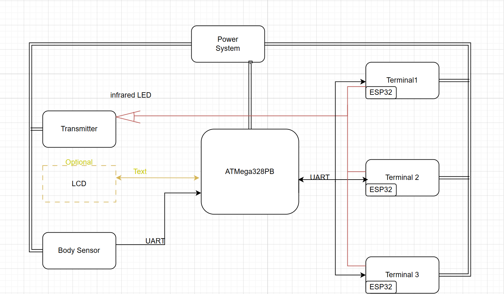

# final-project-skeleton

**Team Number: T01**

**Team Name:**

| Team Member Name | Email Address           |
| ---------------- | ----------------------- |
| Shunyao Jiang    | jiang24@seas.upenn.edu  |
| Sirui Wu         | wu40@seas.upenn.edu     |
| Jingyi Huang     | huang965@seas.upenn.edu |

**GitHub Repository URL: https://github.com/upenn-embedded/final-project-f25-f25-final_project_t1.git**

**GitHub Pages Website URL:** [for final submission]*

## Final Project Proposal

### 1. Abstract

*In a few sentences, describe your final project.*

We propose a gesture-controlled smart-home wristband that enables users to control nearby appliances simply by pointing and performing intuitive hand gestures. The system uses infrared (IR) pairing and communication together with IMU-based orientation sensing to identify and control the target device. Gestures such as opening a hand or lifting the wrist transmit IR commands to appliances such as lights, fans, and air-conditioners. This project demonstrates a low-latency, privacy-preserving, and intuitive approach to human–machine interaction using embedded sensing and wireless control.

### 2. Motivation

*What is the problem that you are trying to solve? Why is this project interesting? What is the intended purpose?*

People often misplace their remote control or phone when sitting on the sofa or chair. Traditional home appliances are typically operated through wall switches or dedicated remotes, while modern smart-home devices rely on smartphone apps or voice assistants. Both approaches require extra steps — such as picking up the phone, finding the right app, or issuing voice commands — which can be  slow, inconvenient, or unreliable , especially in noisy environments where voice recognition fails.

Furthermore, most current smart-home systems require appliances to have built-in IoT modules, making it difficult for legacy devices to be integrated. We aim to create a wearable, unobtrusive wristband that allows users to control any household appliance intuitively through  pointing and hand gestures .

Each appliance is equipped with a unique infrared (IR) code that can be paired with the wristband through a simple  IR pairing process . When the user points toward a specific device, the wristband determines the target direction using its  IMU orientation data , verifies the paired IR code, and transmits the corresponding IR control signal to perform the intended action.

This approach enables seamless control of both modern and traditional appliances —  without a phone, app, or voice assistant . Unlike camera-based gesture systems, our design uses only  on-board IMU and infrared communication , ensuring complete privacy, low power consumption, and real-time response in any lighting condition.

### 3. System Block Diagram

Draft:

Block Diagram:

### 4. Design Sketches

*What will your project look like? Do you have any critical design features? Will you need any special manufacturing techniques to achieve your vision, like power tools, laser cutting, or 3D printing?  Submit drawings for this section.*

### 5. Software Requirements Specification (SRS)

The system shall:

1. Select a terminal using IR signals.
2. Generate control values from IMU sensor data;
3. Send control commands via UDP to only the selected terminal;
4. Ensure reliable communication and data persistence.

**5.1 Definitions, Abbreviations**

| Term                                      | Definition                                                                                                      |
| ----------------------------------------- | --------------------------------------------------------------------------------------------------------------- |
| **IR (Infrared)**                   | Infrared radiation used for terminal selection via 38 kHz ± 1 kHz carrier modulation.                          |
| **LOS (Line-of-Sight)**             | Direct optical path between transmitter (IR LED) and receiver (IR sensor).                                      |
| **IMU (Inertial Measurement Unit)** | Sensor providing 3-axis acceleration and angular velocity, used to generate control values (e.g., PWM duty).    |
| **LEDC / PWM**                      | ESP32 hardware PWM peripheral used for motor control output.                                                    |
| **UDP**                             | User Datagram Protocol used for communication between controller and terminals.                                 |
| **ACK**                             | Acknowledgment packet returned by a terminal after a command is executed.                                       |
| **Select (Selection)**              | The process where the controller designates one terminal as the current active device through IR hit detection. |
| **RTT (Round-Trip Time)**           | Time between command transmission and action confirmation.                                                      |
| **Flash**                           | Non-volatile memory used to store terminal IDs, calibration data, and learned IR codes.                         |

**5.2 Functionality**

| ID                                                             | Description (Measurable Requirement)                                                                                                                                                        | Verification Method                                                                                        |
| -------------------------------------------------------------- | ------------------------------------------------------------------------------------------------------------------------------------------------------------------------------------------- | ---------------------------------------------------------------------------------------------------------- |
| **SRS-01 (IR Detection and Response)**                   | When the controller emits an IR selection signal, the hit terminal shall detect and report its ID to the controller within**≤ 150 ms**.                                                    | Use a logic analyzer to record the IR trigger and UDP report timestamps; across 50 trials, 95 % ≤ 150 ms. |
| **SRS-02 (Selection Confirmation)**                      | After receiving a hit report, the controller shall send a confirmation command within**≤ 50 ms**; the selected terminal shall flash its LED twice within**≤ 200 ms**.               | Capture packet time and LED signal waveform; delay ≤ 200 ms.                                              |
| **SRS-03 (Selection Accuracy)**                          | Under indoor lighting ≤ 800 lx and LOS conditions, for 50 selection attempts per terminal:**false-selection ≤ 1 %**, **miss rate ≤ 1 %**.                                    | Fix three terminals ≥ 40° apart or ≥ 0.5 m apart; compare target vs. actual IDs.                        |
| **SRS-04 (IMU Data Acquisition and Control Generation)** | The IMU shall sample at**≥ 100 Hz** and update control values every**≤ 20 ms**. Under static conditions, output jitter (σ) ≤ 3 % full scale.                                      | Log control values for 60 s and analyze update period and σ.                                              |
| **SRS-05 (Control Command Transmission and Execution)**  | Upon receiving a new IMU control value, the controller shall send a UDP command within**≤ 50 ms**; the terminal shall update its PWM within**≤ 120 ms**. End-to-end 95th ≤ 180 ms. | Use serial logs and oscilloscope to measure timing differences across 100 trials.                          |
| **SRS-06 (Exclusive Response)**                          | Only the selected terminal shall execute LED/PWM commands; non-selected terminals must show no GPIO changes.                                                                                | Monitor all terminals simultaneously; 20 command sets → 0 false responses.                                |
| **SRS-07 (UDP Reliability and Retry)**                   | If no ACK is received within 50 ms, the controller shall retry ≤ 3 times; if all fail, log an error and notify the user. Under normal conditions, command failure ≤ 0.5 % per hour.       | Test under normal and packet-loss scenarios for 1 hour; record retry counts and failures.                  |
| **SRS-08 (Data Storage and Recovery)**                   | After calibration or IR learning, data shall be saved to Flash within**≤ 200 ms**. After power loss, the system shall restore control capability within**≤ 5 s**.                   | Perform three power-cycle tests and verify data integrity and recovery time.                               |
| ID | Description (Measurable Requirement) | Verification Method |
|----|--------------------------------------|----------------------|
| **SRS-01 (IR Detection and Response)** | When the controller emits an IR selection signal, the hit terminal shall detect and report its ID to the controller within ≤ 150 ms. | Use a logic analyzer to record the IR trigger and UDP report timestamps; across 50 trials, 95 % ≤ 150 ms. |
| **SRS-02 (Selection Confirmation)** | After receiving a hit report, the controller shall send a confirmation command within ≤ 50 ms; the selected terminal shall flash its LED twice within ≤ 200 ms. | Capture packet time and LED signal waveform; delay ≤ 200 ms. |
| **SRS-03 (Selection Accuracy)** | Under indoor lighting ≤ 800 lx and LOS conditions, for 50 selection attempts per terminal: false-selection ≤ 1 %, miss rate ≤ 1 %. | Fix three terminals ≥ 40° apart or ≥ 0.5 m apart; compare target vs. actual IDs. |
| **SRS-04 (IMU Data Acquisition and Control Generation)** | The IMU shall sample at ≥ 100 Hz and update control values every ≤ 20 ms**. Under static conditions, output jitter (σ) ≤ 3 % full scale. | Log control values for 60 s and analyze update period and σ. |
| **SRS-05 (Control Command Transmission and Execution)** | Upon receiving a new IMU control value, the controller shall send a UDP command within ≤ 50 ms; the terminal shall update its PWM within ≤ 120 ms. End-to-end 95th ≤ 180 ms. | Use serial logs and oscilloscope to measure timing differences across 100 trials. |
| **SRS-06 (Exclusive Response)** | Only the selected terminal shall execute LED/PWM commands; non-selected terminals must show no GPIO changes. | Monitor all terminals simultaneously; 20 command sets → 0 false responses. |
| **SRS-07 (UDP Reliability and Retry)** | If no ACK is received within 50 ms, the controller shall retry ≤ 3 times; if all fail, log an error and notify the user. Under normal conditions, command failure ≤ 0.5 % per hour. | Test under normal and packet-loss scenarios for 1 hour; record retry counts and failures. |
| **SRS-08 (Data Storage and Recovery)** | After calibration or IR learning, data shall be saved to Flash within ≤ 200 ms. After power loss, the system shall restore control capability within ≤ 5 s. | Perform three power-cycle tests and verify data integrity and recovery time. |

### 6. Hardware Requirements Specification (HRS)

The hardware is designed to ensure that infrared (IR) selection, IMU-based control, and terminal response meet all corresponding software requirements.

**6.1 Definitions, Abbreviations**

Here, you will define any special terms, acronyms, or abbreviations you plan to use for hardware

| Term                                      | Definition                                                                                                               |
| ----------------------------------------- | ------------------------------------------------------------------------------------------------------------------------ |
| **IR (Infrared)**                   | Electromagnetic radiation in the 850–950 nm range (typically 940 nm) used for terminal selection and control.           |
| **Carrier**                         | The modulated carrier frequency for IR transmission, nominally**38 kHz ± 1 kHz**.                                 |
| **NEC / RC5 / RC6**                 | Common IR modulation protocols; this project uses a simplified pulse-distance modulation based on NEC.                   |
| **LOS (Line-of-Sight)**             | Direct, unobstructed optical path between the controller’s IR LED and the terminal’s IR receiver.                      |
| **FOV (Field of View)**             | The angular range within which the IR receiver can reliably detect incoming IR signals.                                  |
| Term | Definition |
|------|-------------|
| **IR (Infrared)** | Electromagnetic radiation in the 850–950 nm range (typically 940 nm) used for terminal selection and control. |
| **Carrier** | The modulated carrier frequency for IR transmission, nominally 38 kHz ± 1 kHz. |
| **NEC / RC5 / RC6** | Common IR modulation protocols; this project uses a simplified pulse-distance modulation based on NEC. |
| **LOS (Line-of-Sight)** | Direct, unobstructed optical path between the controller’s IR LED and the terminal’s IR receiver. |
| **FOV (Field of View)** | The angular range within which the IR receiver can reliably detect incoming IR signals. |
| **IMU (Inertial Measurement Unit)** | Sensor module containing a 3-axis accelerometer and gyroscope used to generate dynamic control inputs (e.g., PWM level). |
| **LEDC / PWM**                      | ESP32 hardware PWM controller used for motor control signal generation.                                                  |
| **RMT (Remote Control Peripheral)** | ESP32 peripheral used for precise generation of the 38 kHz carrier waveform.                                             |
| **EEPROM / Flash**                  | Non-volatile memory used to store terminal IDs, calibration constants, and learned IR patterns.                          |
| **ACK**                             | A short acknowledgment signal sent by a terminal after receiving a valid command.                                        |

**6.2 Functionality**

| ID                                             | Description                                                                                                                                                                                                                                                                    |
| ---------------------------------------------- | ------------------------------------------------------------------------------------------------------------------------------------------------------------------------------------------------------------------------------------------------------------------------------ |
| **HRS-01 (IR Selection and Detection)**  | The controller shall transmit modulated IR bursts at**38 kHz ± 1 kHz**, and each terminal shall detect and decode these bursts using a demodulating receiver (e.g., TSOP38238). A valid hit shall be recognized and reported to the controller within **150 ms**. |
| **HRS-02 (IR Coverage and Range)**       | The IR link shall maintain reliable operation at**3 m ±25° horizontal FOV** and achieve a minimum effective range of **8 m LOS** under standard indoor lighting (≤ 800 lx).                                                                                     |
| **HRS-03 (IR Pulse Accuracy)**           | The generated IR pulses shall have a carrier accuracy of**38 kHz ± 1 kHz** and a pulse-width deviation ≤ **±5 %** relative to the nominal pattern.                                                                                                              |
| **HRS-04 (IMU Sampling and Interface)**  | The IMU module shall output 3-axis acceleration and angular velocity data at**≥ 100 Hz**, communicating with the controller via**I²C** (400 kHz bus) with data latency ≤ **10 ms**.                                                                             |
| **HRS-05 (PWM Output Hardware)**         | Each terminal shall generate motor control signals using the ESP32 LEDC peripheral at**20 kHz ± 0.5 kHz**, with duty-cycle linearity error ≤ **±5 %FS** over 0–100 %.                                                                                          |
| **HRS-06 (Power and Protection)**        | All boards shall operate from a regulated**5 V ± 5 %** supply; the IR LED driver shall limit continuous current to **≤ 100 mA** and include reverse-polarity and over-current protection.                                                                        |
| **HRS-07 (Non-Volatile Data Retention)** | Terminal IDs, IMU calibration data, and learned IR codes shall be stored in on-board Flash memory and retain integrity for**≥ 100 power cycles** or**1 year** without power.                                                                                            |
| ID | Description |
|----|-------------|
| **HRS-01 (IR Selection and Detection)** | The controller shall transmit modulated IR bursts at 38 kHz ± 1 kHz, and each terminal shall detect and decode these bursts using a demodulating receiver (e.g., TSOP38238). A valid hit shall be recognized and reported to the controller within 150 ms. |
| **HRS-02 (IR Coverage and Range)** | The IR link shall maintain reliable operation at 3 m ±25° horizontal FOV** and achieve a minimum effective range of 8 m LOS under standard indoor lighting (≤ 800 lx). |
| **HRS-03 (IR Pulse Accuracy)** | The generated IR pulses shall have a carrier accuracy of 38 kHz ± 1 kHz and a pulse-width deviation ≤ ±5 % relative to the nominal pattern. |
| **HRS-04 (IMU Sampling and Interface)** | The IMU module shall output 3-axis acceleration and angular velocity data at ≥ 100 Hz, communicating with the controller via I²C (400 kHz bus) with data latency ≤ 10 ms. |
| **HRS-05 (PWM Output Hardware)** | Each terminal shall generate motor control signals using the ESP32 LEDC peripheral at 20 kHz ± 0.5 kHz, with duty-cycle linearity error ≤ ±5 %FS over 0–100 %. |
| **HRS-06 (Power and Protection)** | All boards shall operate from a regulated 5 V ± 5 % supply; the IR LED driver shall limit continuous current to ≤ 100 mA and include reverse-polarity and over-current protection. |
| **HRS-07 (Non-Volatile Data Retention)** | Terminal IDs, IMU calibration data, and learned IR codes shall be stored in on-board Flash memory and retain integrity for ≥ 100 power cycles or 1 year without power. |

### 7. Bill of Materials (BOM)

[BOM](https://docs.google.com/spreadsheets/d/1c-6980lmOFAT00yxSfOrNvSX52xN2UV2bh0UHBwkyfA/edit?usp=sharing)

### 8. Final Demo Goals

On demo day, we will demonstrate the gesture-controlled infrared wristband in an  indoor smart-home setup . The wristband will be  worn on the user's wrist , and several IR receiver modules will control mock appliances such as a lamp and fan.

The demo will include:

1. Pairing – The user points at an appliance and pairs it via IR.
2. Control – Gestures like hand opening or wrist lifting trigger corresponding IR commands.
3. Feedback – The appliance responds (e.g., lamp toggles), and receiver LEDs confirm success.

The system will run in a  2 m × 2 m area , powered by batteries or USB. The demonstration highlights  low-latency gesture response ,  accurate direction-based control , and  intuitive, phone-free smart-home interaction .

### 9. Sprint Planning

*You've got limited time to get this project done! How will you plan your sprint milestones? How will you distribute the work within your team? Review the schedule in the final project manual for exact dates.*

| Milestone  | Functionality Achieved                                                                                                         | Distribution of Work                                                                                                                                                                                      |
| ---------- | ------------------------------------------------------------------------------------------------------------------------------ | --------------------------------------------------------------------------------------------------------------------------------------------------------------------------------------------------------- |
| Sprint #1  | Basic IMU gesture detection (hand open / wrist lift); single-device IR transmission test                                       | Shunyao Jiang: IMU data collection and gesture classification algorithm Sirui Wu: IR transmitter and receiver circuit prototyping Jingyi Huang: Microcontroller setup and communication testing |
| Sprint #2  | IR pairing logic for multi-device control; combine IMU + IR modules on wristband                                               | Shunyao Jiang: Firmware integration of gesture and IR modules  Sirui Wu: Compact hardware design and power management Jingyi Huang: IR pairing protocol and system debugging                    |
| MVP Demo   | Working prototype controlling two appliances (lamp and fan) via gestures; LED and vibrationfeedback confirmation               | Shunyao Jiang: Optimize gesture detection and reduce latency Sirui Wu: Assemble wristband and receiver modules Jingyi Huang: Coordinate demo setup and test user interactions                   |
| Final Demo | Fully wearable wristband with rechargeable battery, accurate gesture recognition, and stable IR control of multiple appliances | Shunyao Jiang: Final firmware refinement and data smoothing Sirui Wu: Hardware polishing and enclosure assembly Jingyi Huang: Integration, presentation, and live demonstration coordination    |

**This is the end of the Project Proposal section. The remaining sections will be filled out based on the milestone schedule.**

## Sprint Review #1

### Last week's progress

### Current state of project

### Next week's plan

## Sprint Review #2

### Last week's progress

### Current state of project

### Next week's plan

## MVP Demo

1. Show a system block diagram & explain the hardware implementation.
2. Explain your firmware implementation, including application logic and critical drivers you've written.
3. Demo your device.
4. Have you achieved some or all of your Software Requirements Specification (SRS)?

   1. Show how you collected data and the outcomes.
5. Have you achieved some or all of your Hardware Requirements Specification (HRS)?

   1. Show how you collected data and the outcomes.
6. Show off the remaining elements that will make your project whole: mechanical casework, supporting graphical user interface (GUI), web portal, etc.
7. What is the riskiest part remaining of your project?

   1. How do you plan to de-risk this?
8. What questions or help do you need from the teaching team?

## Final Project Report

Don't forget to make the GitHub pages public website!
If you’ve never made a GitHub pages website before, you can follow this webpage (though, substitute your final project repository for the GitHub username one in the quickstart guide):  [https://docs.github.com/en/pages/quickstart](https://docs.github.com/en/pages/quickstart)

### 1. Video

[Insert final project video here]

* The video must demonstrate your key functionality.
* The video must be 5 minutes or less.
* Ensure your video link is accessible to the teaching team. Unlisted YouTube videos or Google Drive uploads with SEAS account access work well.
* Points will be removed if the audio quality is poor - say, if you filmed your video in a noisy electrical engineering lab.

### 2. Images

[Insert final project images here]

*Include photos of your device from a few angles. If you have a casework, show both the exterior and interior (where the good EE bits are!).*

### 3. Results

*What were your results? Namely, what was the final solution/design to your problem?*

#### 3.1 Software Requirements Specification (SRS) Results

*Based on your quantified system performance, comment on how you achieved or fell short of your expected requirements.*

*Did your requirements change? If so, why? Failing to meet a requirement is acceptable; understanding the reason why is critical!*

*Validate at least two requirements, showing how you tested and your proof of work (videos, images, logic analyzer/oscilloscope captures, etc.).*

| ID     | Description                                                                                               | Validation Outcome                                                                          |
| ------ | --------------------------------------------------------------------------------------------------------- | ------------------------------------------------------------------------------------------- |
| SRS-01 | The IMU 3-axis acceleration will be measured with 16-bit depth every 100 milliseconds +/-10 milliseconds. | Confirmed, logged output from the MCU is saved to "validation" folder in GitHub repository. |

#### 3.2 Hardware Requirements Specification (HRS) Results

*Based on your quantified system performance, comment on how you achieved or fell short of your expected requirements.*

*Did your requirements change? If so, why? Failing to meet a requirement is acceptable; understanding the reason why is critical!*

*Validate at least two requirements, showing how you tested and your proof of work (videos, images, logic analyzer/oscilloscope captures, etc.).*

| ID     | Description                                                                                                                        | Validation Outcome                                                                                                      |
| ------ | ---------------------------------------------------------------------------------------------------------------------------------- | ----------------------------------------------------------------------------------------------------------------------- |
| HRS-01 | A distance sensor shall be used for obstacle detection. The sensor shall detect obstacles at a maximum distance of at least 10 cm. | Confirmed, sensed obstacles up to 15cm. Video in "validation" folder, shows tape measure and logged output to terminal. |
|        |                                                                                                                                    |                                                                                                                         |

### 4. Conclusion

Reflect on your project. Some questions to address:

* What did you learn from it?
* What went well?
* What accomplishments are you proud of?
* What did you learn/gain from this experience?
* Did you have to change your approach?
* What could have been done differently?
* Did you encounter obstacles that you didn’t anticipate?
* What could be a next step for this project?

## References

Fill in your references here as you work on your final project. Describe any libraries used here.
